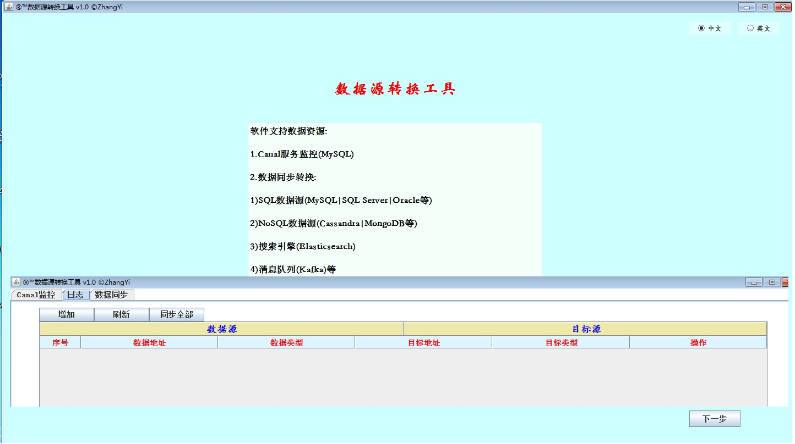
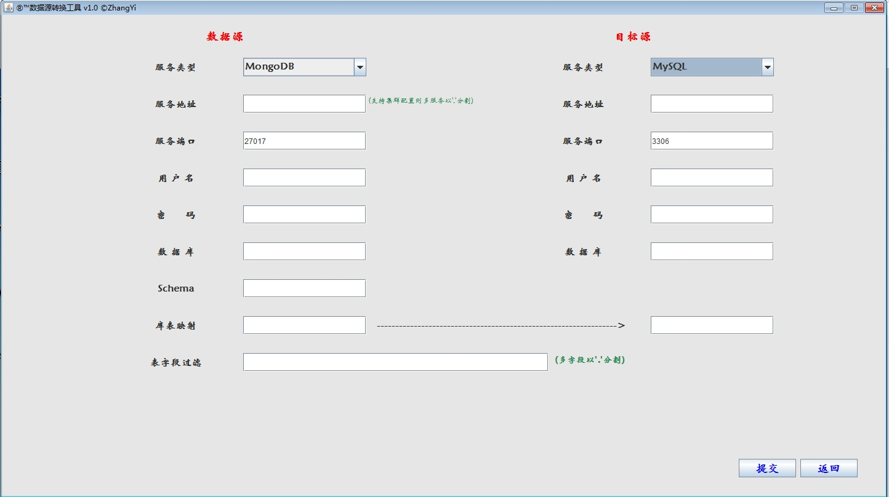

# database-transform-tool
为数据监控以及数据同步提供C/S方式的J2SE的swing的图形化界面服务，并为服务提供高性能的同步以及监控服务。 
可支持数据同步的数据源或数据库有：
- SQL数据源【Oracle|SQL Server|MySQL】；
- NoSQL数据源【MongoDB|Cassandra|Redis】；
- 数据引擎【Elasticsearch】；
- 数据仓库【GreenPlum|PostgreSQL】；
- 消息队列【Kafka】 
提供Canal可支持【MySQL|MariaDB】数据库监控以及数据备份。
### 1. Canal监控【MySQL|MariaDB】
### 2. 数据资源类型
* 1）Elasticsearch服务(Transport/Rest/HighLevelRest)
* 2）NoSQL服务[Cassandra|MongoDB|Redis|Memecached]
* 3）SQL服务[MySQL|SQL　Server|Oracle]
* 4）数据仓库(GreenPlum|PostgreSQL)
* 5）消息队列(Kafka)
### 3. 同步数据转换类型：
* 1）Cassandra-->Cassandra
* 2）Cassandra-->MongoDB
* 3）Cassandra-->MySQL|SQL　Server|Oracle
* 4）Cassandra-->Greenplum
* 5）MongoDB-->Cassandra
* 6）MongoDB-->MySQL|SQL　Server|Oracle
* 7）MongoDB-->Greenplum
* 8）MongoDB-->MongoDB
* 9）[MySQL|SQL　Server|Oracle]-->Cassandra
* 10）[MySQL|SQL　Server|Oracle]-->MongoDB
* 11）[MySQL|SQL　Server|Oracle]-->[MySQL|SQL　Server|Oracle]
* 12）[MySQL|SQL　Server|Oracle]-->Greenplum
* 13）Greenplum-->Cassandra
* 14）Greenplum-->Greenplum
* 15）Greenplum-->MongoDB
* 16）[MySQL|SQL　Server|Oracle]-->Greenplum
### 4. 图形界面

